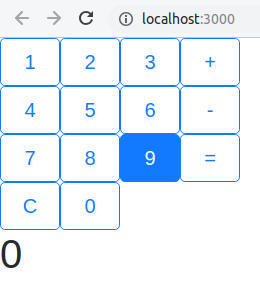
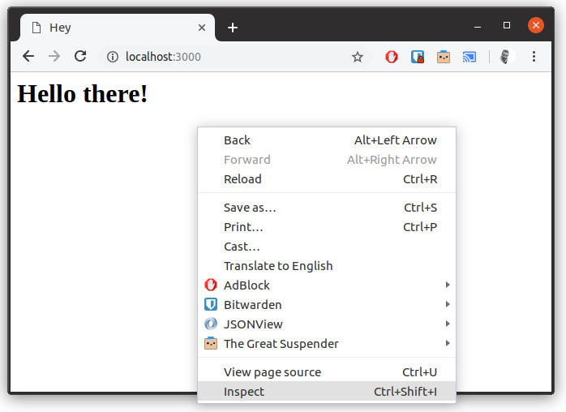
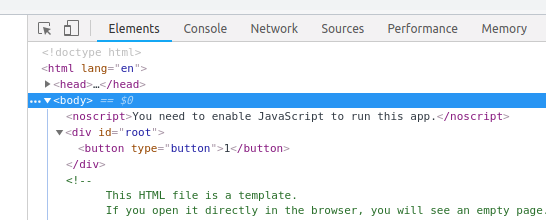
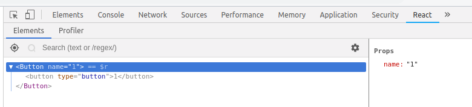
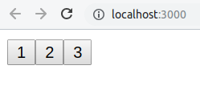
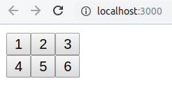
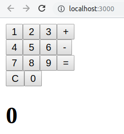
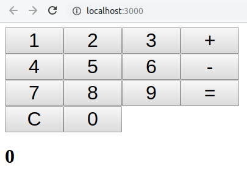
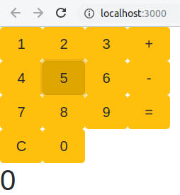

# Module 4 React

# [React Calculator](../calculator)

## 1 What is React
React is a JavaScript library for creating the user interface ("view") based on web technologies (HTML). React _renders_ html from JavaScript.

## 2 What React is not

React **is not** a complete framework for creating a web application. React provides the tools for creating the user interface ("view") and does not include a framework for fetching the data ("model") or the logic for deciding what to display ("controller").

**Angular** is a compete framework for creating web applications. **React** is a library for rendering the user interface.

## 3 Setup

Create a react project and update the version of react.

```cmd
yarn create react-app m4
cd m4
yarn add react@next react-dom@next
```

_We update the version of React to access some of the latest features._

**Delete** all of the files inside your `src` directory. Either with Windows Explorer or in the console:

```cmd
cd src
del *
```

Add the file `src/index.js`:
```jsx
import React from 'react';
import ReactDOM from 'react-dom';

// YOUR CODE HERE

ReactDOM.render(
  <Button />,
  document.getElementById('root')
);
```

## 4 Components

React allows us to organize our code into small reusable pieces called "components". Components are composed together to create complex user interfaces.

There several ways to write components. The traditional way is a class based component that extends `React.component`:

```jsx
class ShoppingList extends React.Component {
  render() {
    return (
      <div className="shopping-list">
        <h1>Shopping List for {this.props.name}</h1>
        <ul>
          <li>Instagram</li>
          <li>WhatsApp</li>
          <li>Oculus</li>
        </ul>
      </div>
    );
  }
}

// Example usage: <ShoppingList name="Mark" />
```

**Components tell react what to render on the screen.**

A few important points:
* A component takes a parameter named `props` and returns a hierarchy of views to display to the user in the `render` method
* The `render` function returns a _description_ of what you want to see on the screen. React uses that description and displays the result.
* `render` actually returns a **React element**, however, most developers use JSX (the HTML looking tags in the above example)
* JSX mixes HTML syntax and JavaScript! Inside JSX we can put _any_ JavaScript inside `{ }` braces.
* React elements are JavaScript script objects that you store in variables and pass around inside your app.

The JSX compiler transforms return of the `render` function above example into this:

```javascript
return React.createElement('div', {className: 'shopping-list'},
  React.createElement('h1', /* ... h1 children ... */),
  React.createElement('ul', /* ... ul children ... */)
);
```

☝️ Here we are only rendering typical HTML elements (`<div>`, `<h1>`, etc.), but we can render other react components in the same way. For example we can now render the entire shopping list with `<ShoppingList />`. This is the magic of React!

## 5 Functional Components

While class components are very common, they require a lot of typing and have pitfalls around using the `this` pointer that require a extra care. A more modern way to write components is using a function syntax, also known as **Functional Components**.

**For this course, we will use functional components.**

The above component can be simplified by using functional syntax:

```jsx
const ShoppingList = (props) => (
  <div className="shopping-list">
    <h1>Shopping List for {props.name}</h1>
    <ul>
      <li>Instagram</li>
      <li>WhatsApp</li>
      <li>Oculus</li>
    </ul>
  </div>
);
```

☝️ The above _functional_ syntax requires less typing and removes some of the strange problems involving `this`, since we don't use it!

## 6 Calculator

We are going to build a small calculator application using React. Here is the goal:



You can see a [live demo here](../calculator).

#### Exercise 6.1: The button component.

1. Inside `src/index.js` add the following code:

   ```jsx
   import React from 'react';
   import ReactDOM from 'react-dom';

   // YOUR CODE HERE

   const Button = (props) => <button type="button">{props.name}</button>

   ReactDOM.render(
     <Button name='1'/>,
     document.getElementById('root')
   );
   ```
1. In the terminal run:
   ```cmd
   npm start
   ```
   The above command should open a window in Chrome with a single button.
1. Inspect the html generated on the page (F12):

   

   

1. Install the [React Developer Tools for Chrome](https://chrome.google.com/webstore/detail/react-developer-tools/fmkadmapgofadopljbjfkapdkoienihi?hl=fr) and open the "React" tab in the developers tools.
    
   **If you cannot install the React Developer Tools for Chrome, use Firefox and install the [React Developer Tools for Firefox](https://addons.mozilla.org/en-US/firefox/addon/react-devtools/)**

1. Open the React tab in your developer tools:

   

#### Question 6.1: Inside the react dev tools, what happens if you change the property `name` the button component?

#### Exercise 6.2: The KeyRow component.


1. Add new `KeyRow` component _after_ the declaration of the `Button` component:
   ```jsx
   const KeyRow = (props) => {
     const buttons = props.row.map(k => <Button name={k} />);
     return <div>{buttons}</div>;
   }
   ```
   * _💡 A functional component is simply a function that returns JSX directly `() => <div>...</div>` or can calculate components with JavaScript and return JSX at the end of the function ☝️._

1. Update the call to `ReactDOM.render()` to use the new `KeyRow` component:

   ```jsx
   ReactDOM.render(
     <KeyRow row={['1', '2', '3']}/>,
     document.getElementById('root')
   );
   ```
   * _💡 Inside JSX, we can put **any JavaScript** inside the `{ }` curly braces._

1. Test your changes in Chrome, it should result the following:

   


#### Exercise 6.3 Add `KeyPad` component that takes property names `keys` that is a nested array of keys:
* the `keys` property should except a 2-dimensional array of keys, i.e. `[['1', '2', '3'], ['4', '5', '6']]`
* each array, i.e. `['1', '2', '3']` in the keys property should render a `KeyRow`
* the goal is to build on the previous components
* update your call to `ReactDOM.render()` to instantiate your `KeyPad`:
  ```jsx
  ReactDOM.render(
    <KeyPad keys={[['1', '2', '3'], ['4', '5', '6']]}/>,
    document.getElementById('root')
  );
  ```
* The result should look like this

  

#### Exercise 6.4: The calculator component.

1. The final `Calculator` component that will encapsulate all of the calculator logic, render the `KeyPad` component, and the results.

   ```jsx
   const Calculator = () => {
     const keys = [
       ['1', '2', '3', '+'],
       ['4', '5', '6', '-'],
       ['7', '8', '9', '='],
       ['C', '0']
     ];
     return ( 
       <div>
         <KeyPad keys={keys} />
         <h1>0</h1>
       </div>
     );
   }
   ```

   * the component has no properties so there is no `props` parameter

1. Observe the results in Chrome:

   

☝️ The results are **ugly!**

#### Exercise 6.5: A little style.

* Fix the button alignment by adding some CSS style to the `Button` component:

  ```jsx
  const Button = (props) => <button type="button" style={{fontSize: '2em', width: '3em'}}>{props.name}</button>
  ```

* Remember, in JSX we can put any JavaScript inside the `{ }` curly braces. Here we are putting an object `{fontSize: '2em'...}` inside the `{ }` curly braces. That is why there are double braces `{{...}}`.
* React lets us write CSS using JavaScript style camelCase. Instead of css [font-size](https://developer.mozilla.org/fr/docs/Web/CSS/font-size) we use `fontSize`.
* The above should result in:

  

## 7 State

So far we have seen properties. Properties cannot be modified by a component, they are *immutable*. Properties let React efficiently decide when something needs to be rendered. If the properties have not changed, React does not need to re-render the component.

Components can also have state. State can be changed by a component. When the state changes, React re-renders the component. **React needs to know when state changes in order for it to decide if a component and it's children need to be re-rendered.** Therefore, when working with state, we have to make React aware.

There are of course multiple ways to manage state. In this course we will use [React hooks](https://reactjs.org/docs/hooks-intro.html). A new feature in React! **Hooks let us use functional components and work with state.**

#### Exercise 7.1: useState hook

1. To use hooks we need to import the hooks functions from React. In `index.js`, modify `import React from 'react'` to:
   ```javascript
   import React, {useState, useReducer} from 'react';
   ```

1. Modify the `Calculator` component to store the results in state:

    ```jsx
    const Calculator = () => {
      const [results, setResults] = useState('0');
      const keys = [
        ['1', '2', '3', '+'],
        ['4', '5', '6', '-'],
        ['7', '8', '9', '='],
        ['C', '0']
      ];
      return ( 
        <div>
          <KeyPad keys={keys} />
          <h1>{results}</h1>
        </div>
      );
    }
    ```

The `useState()` function tells react we want to manage state. It takes a single parameter, the initial value of the state: `'0'` in our case. It has 2 return values, the current value of the state and function we must call to modify state. **We should never modify the state directly, instead we must modify the state through the function that React provides.** This keeps react aware of any changes in state, allow it to decide when something must be re-rendered.

The `setResults()` function will update the value of the state. However, it is only accessible inside the the `Calculator` component. However, we want to update the state when a `Button` is pressed (the `onClick` event).

Fortunately, we can pass the function as a property to a components children. One solution will be to pass the function through each child:

The Calculator:
```jsx
const Calculator = () => {
  const [results, setResults] = useState('0');
  const keys = [
    ['1', '2', '3', '+'],
    ['4', '5', '6', '-'],
    ['7', '8', '9', '='],
    ['C', '0']
  ];

  // Include setResults as a property to the KeyPad component
  return ( 
    <div>
      <KeyPad keys={keys} setResults={setResults} />
      <h1>{results}</h1>
    </div>
  );
}
```

The goal is to be able to access `setResults()` inside the `Button` component, therefore, each intermediate component (`KeyPad` and `KeyRow`) must pass the function to it's children.

**Option 1:** _The hard way._ We can simple pass the `setResults()` function to each child component:

`KeyPad`:
```jsx
const KeyPad = (props) => {
  const rows = props.keys.map(r => <KeyRow rows={r} setResults={props.setResults} />);
  return <div>{rows}</div>;
}
```

😿️

**Option 2:** _The easier way._ We can take advantage of ES6 JavaScript, simply "relay" the properties using the `...` operator:

```jsx
const KeyRow = (props) => {
  const buttons = props.row.map(k => <Button {...props} name={k} />);
  return <div>{buttons}</div>;
}

const KeyPad = (props) => {
  const rows = props.keys.map(r => <KeyRow {...props} rows={r} />);
  return <div>{rows}</div>;
}
```

_Finally,_ we can access the setResults inside our `Button`:
```jsx
const Button = (props) => <button
    type="button"
    style={{fontSize: '2em', width: '3em'}}
    onClick={() => props.setResults(props.name)}
  >
      {props.name}
  </button>
```

⚠️ ☝️ **To set the state with the value of the button, we use `onClick={() => props.setResults(props.name)}`.**

#### Question 7.1: Test the calculator in Chrome. Clicking on a button should update the character displayed below the keypad. What happens to the "state" when you click on a button?

Now we have an "interactive" keypad. _There is still a problem._ **The calculator is useless!** It does not calculate anything. Setting the key is not enough... we actually need _calculate_ something when a key is pressed.

One option would be to inspect the current state of the calculator inside the `Button` component (requiring us to pass the state to the children) and adding some logic to update the state as needed. _This would be a poor design, separating the state logic (in the `Button` component) from where it is stored (in the `Calculator` component)._

A better, more maintainable, design would be to perform the logic inside in the `Calculator` component. Fortunately, there is another type of React hook that allows us to do just that. A "reducer" in react a function that has two parameters, the current state and an operation to perform on the state: `reducer(state, operation)`. The "reducer" should return the new state.

## 8 useReducer hook

**The calculator logic is more complex than simply storing a single number.** We will need a more complex state:

```javascript
{
  current: '0',    // The current value
  next: null,      // The next value
  operation: null, // The operation to perform
}
```

Next we need a reducer function to contain our calculator logic. 

```javascript
function calculate(state, button) {
  // ...
}
```

For our calculator, our reducer "operation" is the button that was pressed. The reducer should decide what to do based on the operation and must always return the new state (could be the same as the old state). The `switch` statement is perfect since it lets us "fall through" multiple buttons to the same logic.

#### Exercise 8.1 Add the calculate reducer.

1. Add following function to your application. _The function is not yet complete._
    ```javascript
    function calculate(state, button) {
      switch(button) {
        case '1':
        case '2':
        case '3':
        case '4':
        case '5':
        case '6':
        case '7':
        case '8':
        case '9':
        case '0':
          // TODO: RETURN THE MODIFIED STATE
          // return {current, next, operation};
          return state
        case '+':
        case '-':
          return {
            current: state.next || '0',
            next: null,
            operation: button,
          }
        case '=':
          // TODO: PERFORM THE CALCULATION AND RETURN THE MODIFIED STATE
          // return {current, next, operation};
          return state;
        case 'C':
          // When C is pressed, we reset the state
          return {
            current: '0',
            next: null,
            operation: null,
          }
        default:
          // If a button occurred that we did not expect, don't change anything
          return state;
      }
    }
    ```

1. In the `Calculator` component, replace the call to `useState` to `useReducer`:

    ```jsx
    const Calculator = () => {
      const [state, buttonPressed] = useReducer(calculate, {current: '0', next: null, operation: null});
      console.log(state);  // Log the state for debugging

      const keys = [
        ['1', '2', '3', '+'],
        ['4', '5', '6', '-'],
        ['7', '8', '9', '='],
        ['C', '0']
      ];

      // NOTE! we pass buttonPressed to the KeyPad
      return ( 
        <div>
          // Pass the buttonPressed reducer to the children
          <KeyPad keys={keys} buttonPressed={buttonPressed} />
          <h1>{state.next || state.current}</h1>
        </div>
      );
    }
    ```

   * The function that changes the state was renamed to `buttonPressed`.

1. Update the `Button` component to call the `buttonPressed()` function when the `onClick` event occurs:

    ```jsx
    const Button = (props) => <button
        type="button"
        style={{fontSize: '2em', width: '3em'}}
        onClick={() => props.buttonPressed(props.name)}
      >
          {props.name}
      </button>
    ```

1. Open the console view in the Chrome developer tools and observe what happens when you press the button on the calculator.

#### Question 8.1 What happens when you press the buttons `'+'`, `'-'`, and `'='`?

#### Exercise 8.2: Complete the logic inside the `calculate()` function to handle the buttons 0-9 and =.

_Hint: think about how a calculator should function. Refer to the [demo](../calculator)_ for an example.

## 9 State Management

Managing state is a complicated task. Large projects often store the majority of the state in a single place, called "global state". [Redux](https://redux.js.org/) is a tool for managing state. [react-redux](https://react-redux.js.org/) is library to work with redux in React.

## 10 Styling

Functionally, the calculator is now working, but it is _still **ugly**_! We can easily add some style with CSS. One option would be to manually improve the `style` property of the `Button` component.

Or we can use some **preconfigured styling**.

[Bootstrap]() from twitter provides some excellent CSS templates. We will only use the button styling, but Bootstrap offers so much more.

#### Exercise 10.1: Styling with Bootstrap.

1. Add some more dependencies to our project.

    ```cmd
    yarn add bootstrap jquery popper.js
    ```

    * Bootstrap requires [jquery](https://jquery.com/) and [popper.js](https://popper.js.org/), but they are not installed automatically. Therefor, we must install them explicitly.

1. Add bootstrap to `src/index.js`:
    ```javascript
    import React, {useReducer} from 'react';
    import ReactDOM from 'react-dom';
    import 'bootstrap/dist/css/bootstrap.min.css';
    import 'bootstrap';
    ```

1. React lets us add CSS classes with the `className` property. **`class` is a reserved word in JavaScript, so always use `className` in React.** We will also simplify the previous `style` in our `Button` component:

    ```jsx
    const Button = (props) => <button
        type="button"
        className='btn btn-outline-primary btn-lg'
        style={{width: '3em'}}
        onClick={() => props.buttonPressed(props.name)}
      >
          {props.name}
      </button>
    ```

1. Observe the calculator in Chrome. There should be some beautiful style:

    

#### Exercise 4.4: Modify the CSS classes to give the calculator the following style:



* Checkout the bootstrap docs for several possibilities, starting with the [Button docs](https://getbootstrap.com/docs/4.0/components/buttons/).


<!--

Clone this github repository: xxx

git clone xxx

cd xxx

npm run dev

The above repository is an application based on the next.js framework. Next.js is framework for working with react 
nsisting of classes and function calls.

As mentioned before react is simply the "view" of an application. The other tools and frameworks that are required build an application with React can be called the React ecosystem. For this exercise, we will not spend much time reviewing all of the tools necessary to create an application with react. Instead we will focus on learning how to build a user interface using react.


```bash
yarn create next-app module4
cd module4
npm run dev
```

Navigate to http://localhost:1234

*TODO:*
- [ ] finish calculator tutorial
- [x] pass state setting to children
- [x] add useReducer
- [ ] consider contextAPI to pass state setter to deep children
- [x] host the final app somewhere
- [ ] add bonus: 2nd page that fetches countries from module 3 and renders a list of countries
- [ ] add questions

-->