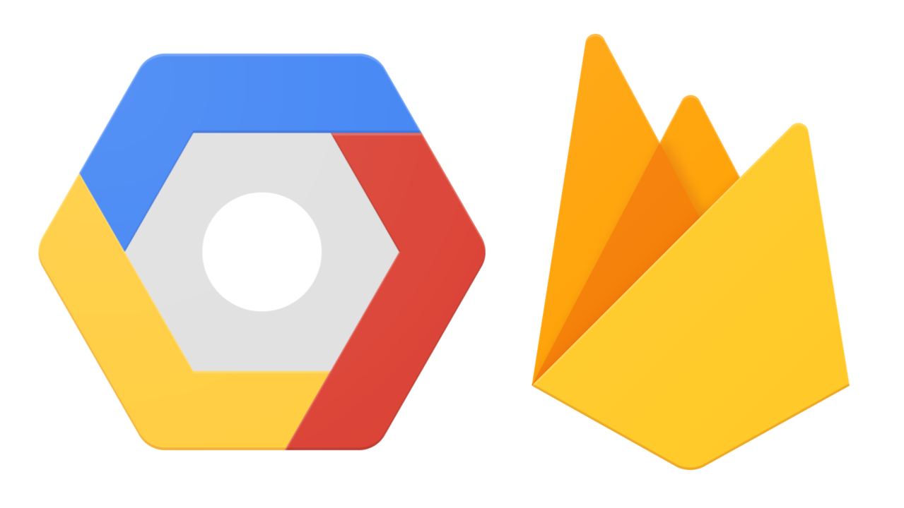

# Cloud

What is the cloud?

The cloud is made up of managed computing resource, services and storage. When creating a cloud application, the goal is to save time by not needing to configure servers and possibly save money by not needing to purchase computer hardware.

There are three large cloud providers:
- Amazon AWS
- Google Cloud Services
- Microsoft Azure

Cloud services are generally billed using a "pay-as-you-go" model, meaning you pay for the resources used.

# Firebase

[Firebase](https://firebase.google.com/) is a mobile and web application development platform integrated with Google Cloud Services.

As a **web developer**, Firebase offers several useful services listed below.

**Firebase provides a very [generous free, no credit card required, plan](https://firebase.google.com/pricing) allowing for development and deployment a production grade application.**

## Hosting

[Firebase Hosting](https://firebase.google.com/products/hosting/)
* easy global deployment of web assets
* free SSL security certificates

## Cloud Functions

[Firebase Cloud Functions](https://firebase.google.com/products/functions/)
* allows serving dynamic content
* allows building backend services
* eliminates the need to configure servers

## Cloud Firestore

[Firebase Cloud Firestore](https://firebase.google.com/products/firestore/)
* NoSQL database
* supports storing, querying, synchronizing, working offline
* user based security
* integrates with Cloud Functions for triggering backend tasks and storing application state

## Storage

[Firebase Cloud Storage](https://firebase.google.com/products/storage/)
* allows storing and serving user generated content like photos and videos
* supports user based security
* integrates with Cloud Functions for trigger backend tasks and managing user assets

## Authentication

[Firebase Authentication](https://firebase.google.com/products/auth/)
* easy sign that works on all platforms
* integrates with google, facebook, twitter, github
* includes UI
* Google class security
* Integrates with Cloud Firestore and Cloud storage for user based security rules