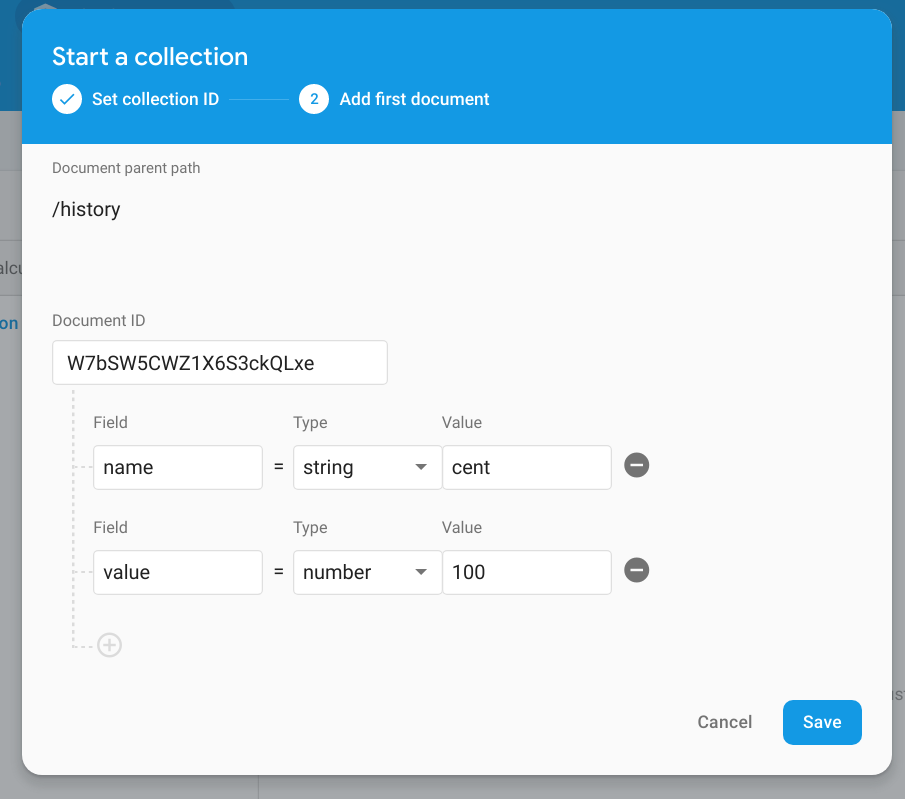
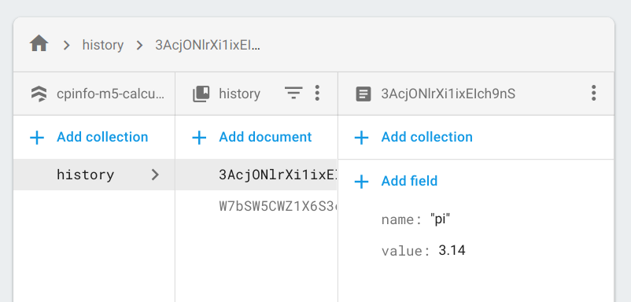

## Add a "route" or page to the calculator

A router lets us navigate between pages inside the browser. This is known as client side routing and is a core concept in a single page application (SPA).

Client side routing consists of 2 primary tasks:
* conditionally rendering components based on the current URL
* providing a mechanism to navigate to new urls without making calls to the server (keeping the forward and back buttons working)

For this activity, we will use the [React Router](https://reacttraining.com/react-router/) for the browser: [react-router-dom](https://reacttraining.com/react-router/web/guides/philosophy).

1. Create a new file `src/Calculator.js` and move all of the components from your `index.js` file to the new file, i.e. (`Button`, `KeyRow`, `KeyPad`, `Calculator`). Export the `Calculator` component at the end of the file:

   ```javascript
   import React, {useState, useReducer} from 'react';

   // ...
   // your components here
   // ...

   const Calculator = () => {
     // ...
   }

   export default Calculator;
   ```

1. Import the `Calculator` component in `index.js`:

   ```javascript
   import React from 'react';
   import ReactDOM from 'react-dom';
   import 'bootstrap/dist/css/bootstrap.min.css';
   import 'bootstrap';
   import Calculator from './Calculator';


   ReactDOM.render(
     <Calculator />,
     document.getElementById('root')
   );
   ```

1. Test your calculator using `yarn start` to ensure it is still working.

1. Add `react-router-dom` to your project:
   ```
   yarn add react-router-dom
   ```

1. Add a new component named `History` in `src/History.js`:
   ```jsx
   import React from 'react';

   const History = () => <h1>history</h1>;

   export default History;
   ```

1. In `index.js` we have to make the following changes:
   * Create an `App` component
   * Surround the `App` with the `BrowserRouter` component from react-router-dom
   * Inside the `App` component, add a `Switch` that contains `Routes` to `Calculator` and `History`

   ```jsx
   import React from 'react';
   import ReactDOM from 'react-dom';
   import 'bootstrap/dist/css/bootstrap.min.css';
   import 'bootstrap';
   import Calculator from './Calculator';
   import History from './History';
   import {BrowserRouter, Switch, Route, Link} from 'react-router-dom';

   // The App component as a switch with our routes
   const App = () => 
     <Switch>
       <Route exact path='/' component={Calculator} />
       <Route exact path='/history' component={History} />
     </Switch>;

   // The app MUST be surrounded by the BrowserRouter
   ReactDOM.render(
     <BrowserRouter>
       <App />
     </BrowserRouter>,
     document.getElementById('root')
   );
   ```

1. Test the 2 routes in your browser. Navigate to http://localhost:3000 and http://localhost:3000/history Notice what happens if you change the `path` in one of the `Routes`.

1. Finally, we can add some navigation between the 2 routes. Inside `src/index.js`, add 2 `Link`'s to the `App` component for navigating between the 2 pages:

   ```jsx
   const App = () => 
     <>
       <Link to='/'>Home</Link> <Link to='/history'>History</Link>
       <Switch>
         <Route exact path='/' component={Calculator} />
         <Route exact path='/history' component={History} />
       </Switch>
     </>
   ```

   ⚠️ A component must have 1 parent tag. Here we used react [fragment](https://reactjs.org/docs/fragments.html) syntax `<> ... </>` tags to wrap our components.

#### Exercise 3: inspect the network calls in the browser:

* What happens when you click on the `Link`'s you added?
* What happens when you use the back and forward buttons?
* What happens when you change the URL in the address bar?

## Client and Server links

   1. Add an anchor `<a href="...">` link to your cloud function inside the `App` component to link to your `helloWorld` cloud function.

   ```jsx
   const App = () => 
     <>
       <Link to='/'>Home</Link> <Link to='/history'>History</Link> <a href="/helloWorld">Hello</a>
       <Switch>
         <Route exact path='/' component={Calculator} />
         <Route exact path='/history' component={History} />
       </Switch>
     </>
   ```

   1. Locally, the new link won't work. Instead, no components after the links will get rendered.

   1. Deploy your entire application to Firebase:
   ```cmd
   yarn build
   npm run firebase -- deploy
   ```

   1. You just deployed an react application that consists of both client and server side code! Click on the links and see that some navigation happens in browser and some happens inside the cloud function.

#### Bonus: Add the code to make the `Link` bold when you navigate to page. i.e. When the calculator is displayed, the `Home` link should be bold. When the history page is displayed, the `History` link should be bold.

💡 Hint: replace `Link` with `NavLink` (see the [documentation here](https://reacttraining.com/react-router/web/api/NavLink) and the example for the `activeStyles` property).

## Load the calculator from a query parameter

1. Add the [query-string](https://github.com/sindresorhus/query-string) package to your project. This package parses the query string: everything after a `?` in a URL i.e. http://localhost:3000?value=5

   ```cmd
   yarn add query-string
   ```
1. Modify `Calculator.js` set the _next_ value of the initial state based a `value` set in the query string.

   ```jsx
   const Calculator = ({location}) => {
     // Parse the query string
     const params = qs.parse(location.search);
     // Use the value, only if it is a valid number
     const initial = Number.isNaN(parseFloat(params.value)) ? null : params.value;
     // Use the parsed value for the "next" field in the initial state
     const [state, buttonPressed] = useReducer(calculate, {current: '0', next: initial, operation: null});
     console.log(state);  // Log the state for debugging

     const keys = [
       ['1', '2', '3', '+'],
       ['4', '5', '6', '-'],
       ['7', '8', '9', '='],
       ['C', '0']
     ];
     return ( 
       <div>
         <KeyPad keys={keys} buttonPressed={buttonPressed} />
         <h1>{state.next || state.current}</h1>
       </div>
     );
   }
   ```

   * The `location` property is added by react router since our component is the child of a route. See [here for the documentation](https://reacttraining.com/react-router/web/api/location)
   * The query string is located in `location.search`. This needs to be parsed by the `query-string` package.
   * Before using the `value` field of the query string in our initial state, we validate it. What if it was a string, like `abc`?
   * We pass the parsed value into the initial state when we call `useReducer`.

1. Test the calculator locally by navigating to http://localhost:3000/value=1000

1. Now add some useful `Link`'s to the `History` component in `History.js`:

   ```jsx
   import React from 'react';
   import {Link} from 'react-router-dom';

   const History = () =>
     <>
       <h1>history</h1>;
       <ul>
         <li><Link to='/?value=3.14'>pi</Link></li>
         <li><Link to='/?value=1000'>mil</Link></li>
       </ul>
     </>;

   export default History;
   ```

### Enable Firestore NoSQL Database in the Firebase Console

1. In the firebase console, navigate to Database and click "Create Database"

   

1. Choose "Start in test mode". _⚠ Note the security warning: **your database is open for anyone to read/write!**_ Click "Create project".

   

## Add history documents to DB

1. In the firebase console, navigate to the Database page

1. Click on "Add collection"

1. Give the collection the name `history` and click "Next".

1. Collections only exist if they contain documents. Therefore, we are required to create an initial document.
   * Click the button "Auto-ID" since we don't care about the name of the document.
   * The document should have 2 fields:
     * `name`: a string set to the display name value
     * `value`: a number set to the value we will load into the calculator.
   * Click "Save" to store the first document
  
   

1. Click "Add Document" in the `history` collection to add a second document. Use an auto ID, set the name to `pi` and the value to `3.14`

   Your collection should resemble this, with unique ids:

   

## Fetch the history from Firestore

1. In the Firebase console, click on the setting gear then "Project settings"

   

1. Scroll down the settings page to the "Your apps" section. Click on the button to add a web app to the project

   

1. Copy the code to initialize the firebase connection.

   

1. Add the Firebase javascript client to our calculator project:

   ```cmd
   yarn add firebase
   ```

1. In `src/History.js` we have to initialize our connection to firebase. Before the declaration of the `History` component, import the firebase packages and paste the configuration code **from your project**. 

   ```jsx
   import React, {useEffect, useState} from 'react';
   import {Link} from 'react-router-dom';
   import firebase from 'firebase/app';
   import 'firebase/firestore';

   // COPY THIS FROM THE FIREBASE CONSOLE
   const config = {
     apiKey: "your-api-key",
     authDomain: "...",
     databaseURL: "...",
     projectId: "...",
     storageBucket: "...",
     messagingSenderId: "..."
   };
   firebase.initializeApp(config);

   const History = () => {
      // ...
   ```

1. Next we will replace the hardcoded links in the `History` with data that we will query directly from the database. In order for that to work, we will need to do the following:
   * Store the links in state using `useState` hook
   * Query the DB when the component is rendered the first rendered ("mounted") using the `useEffect` hook

   ```jsx
   const History = () => {
     const [history, setHistory] = useState([]);
     useEffect(() => {
       getHistory();
     }, []);

     async function getHistory() {
       const snapshot = await firebase.firestore().collection('history').get();
       // GET THE DATA FROM THE SNAPSHOT AND CALL setHistory()
       setHistory(/* PASS THE DATA FROM THE SNAPSHOT HERE! */);
     }

     return (
       <>
         <h1>history</h1>
         <ul>
           {history.map(h => <li key={h.name}><Link to={`/?value=${h.value}`}>{h.name}</Link></li>)}
         </ul>
       </>
     );
   }
   ```

   * `useEffect` _must not_ have a return value. Therefore we call the `getHistory()` function and never call return.
   * The `useEffect` hook will call the passed function based on when the values in the second parameter change. By passing an empty array `[]` the function is only called _once_ when the component is rendered the first time ("mounted").

#### Exercise 3: Complete the `getHistory()` function above to call `setHistory` with an array of links read from the database.

#### Bonus: Add some simple form controls to save history items back to the database. Can you add buttons to delete items?
