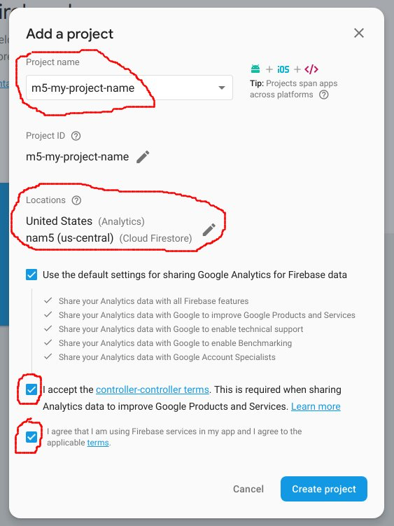

# React router

A router lets us navigate between pages inside the browser. This is known as client side routing and is a core concept in a single page application (SPA).

Client side routing consists of 2 primary tasks:
* conditionally rendering components based on the current URL
* providing a mechanism to navigate to new urls without making calls to the server (keeping the forward and back buttons working)

For this activity, we will use the [React Router](https://reacttraining.com/react-router/) for the browser: [react-router-dom](https://reacttraining.com/react-router/web/guides/philosophy).

## 0 Setup

Start with your calculator project we previously created **or** use the files distributed during the course.

_If you use the files distributed during the course, you may want to create a new firebase project and link it to the project._

**⚠️ Only follow these directions if you choose to use the files distributed during the course. _If you use your existing calculator project, skip to section 1._**

1. [https://console.firebase.google.com](https://console.firebase.google.com)
1. Sign in to your google account
1. "Add project"
1. Give your project a unique name, keep the default settings, and accept all of the options:
   
1. Install the dependencies in the root **and** the functions folder:
   ```cmd
   yarn
   cd functions
   yarn
   cd ..
   ```
1. Build the react project:
   ```cmd
   yarn build
   ```
1. Ensure you are logged into firebase in the console:
   ```cmd
   npm run firebase -- login
   ```
1. Link your local project to your Firebase project:
   ```cmd
   npm run firebase -- use --add
   ```
   1. _" Which project do you want to add?"_ **select the project you create before and press enter**
   1. _"What alias do you want to use for this project? (e.g. staging)"_ **enter `default` and press enter**
1. Deploy the application!
   ```cmd
   npm run firebase -- deploy
   ```
   After the deployment is complete, the the **Hosting URL** shows in the output, you should see the calculator. Also verify adding `/helloWorld`, `/helloHtml`, and `/helloData` all work.

## 1 Add routing to the calculator

1. Create a new file `src/Calculator.js` and move **all of the components** from your `index.js` file to the new file, i.e. (`Button`, `KeyRow`, `KeyPad`, `Calculator`). Export the `Calculator` component at the end of the file:

   ```javascript
   import React, {useState, useReducer} from 'react';

   const Button = () => {
     //...
   };

   const KeyPad = () => {
     //...
   };

   const Calculator = () => {
     // ...
   };

   export default Calculator;
   ```

1. Import the `Calculator` component in `index.js`:

   ```javascript
   import React from 'react';
   import ReactDOM from 'react-dom';
   import 'bootstrap/dist/css/bootstrap.min.css';
   import 'bootstrap';
   import Calculator from './Calculator';


   ReactDOM.render(
     <Calculator />,
     document.getElementById('root')
   );
   ```

1. Test your calculator using `yarn start` to ensure it is still working.

1. Add `react-router-dom` to your project:
   ```
   yarn add react-router-dom
   ```

1. Add a new component named `History` in `src/History.js`:
   ```jsx
   import React from 'react';

   const History = () => <h1>history</h1>;

   export default History;
   ```

1. In `index.js` we have to make the following changes:
   * Create an `App` component
   * Surround the `App` with the `BrowserRouter` component from react-router-dom
   * Inside the `App` component, add a `Switch` that contains `Routes` to `Calculator` and `History`

   ```jsx
   import React from 'react';
   import ReactDOM from 'react-dom';
   import 'bootstrap/dist/css/bootstrap.min.css';
   import 'bootstrap';
   import Calculator from './Calculator';
   import History from './History';
   import {BrowserRouter, Switch, Route, Link} from 'react-router-dom';

   // The App component contains a switch with our routes
   const App = () => 
     <Switch>
       <Route exact path='/' component={Calculator} />
       <Route exact path='/history' component={History} />
     </Switch>;

   // The app MUST be surrounded by the BrowserRouter
   ReactDOM.render(
     <BrowserRouter>
       <App />
     </BrowserRouter>,
     document.getElementById('root')
   );
   ```

1. Test the 2 routes in your browser. Navigate to http://localhost:3000 and http://localhost:3000/history Notice what happens if you change the `path` in one of the `Routes`.

1. Finally, we can add some navigation between the 2 routes. Inside `src/index.js`, add 2 `Link`'s to the `App` component for navigating between the 2 pages:

   ```jsx
   const App = () => 
     <>
       <Link to='/'>Home</Link> <Link to='/history'>History</Link>
       <Switch>
         <Route exact path='/' component={Calculator} />
         <Route exact path='/history' component={History} />
       </Switch>
     </>;
   ```

   ⚠️ A component must have 1 parent tag. Here we used react [fragment](https://reactjs.org/docs/fragments.html) syntax `<> ... </>` tags to wrap our components.

#### Exercise 1.1: inspect the network calls in the browser:

* What happens when you click on the `Link`'s you added?
* What happens when you use the back and forward buttons?
* What happens when you change the URL in the address bar?

## 2 Client and Server links

   1. Add an anchor `<a href="...">` link to your cloud function inside the `App` component to link to your `helloWorld` cloud function.

   ```jsx
   const App = () => 
     <>
       <Link to='/'>Home</Link> <Link to='/history'>History</Link> <a href="/helloWorld">Hello</a>
       <Switch>
         <Route exact path='/' component={Calculator} />
         <Route exact path='/history' component={History} />
       </Switch>
     </>;
   ```

   1. Locally, the new link won't work. Instead, no components after the links will get rendered.

   1. Deploy your entire application to Firebase:
   ```cmd
   yarn build
   npm run firebase -- deploy
   ```

   1. You just deployed an react application that consists of both client and server side code! Click on the links and see that some navigation happens in browser and some happens inside the cloud function.

#### Bonus 2.1 Add the code to make the `Link` bold when you navigate to page. i.e. When the calculator is displayed, the `Home` link should be bold. When the history page is displayed, the `History` link should be bold.

💡 Hint: replace `Link` with `NavLink` (see the [documentation here](https://reacttraining.com/react-router/web/api/NavLink) and the example for the `activeStyles` property).

## 3 Load the calculator from a query parameter

1. Add the [query-string](https://github.com/sindresorhus/query-string) package to your project. This package parses the query string: everything after a `?` in a URL i.e. http://localhost:3000?value=5

   ```cmd
   yarn add query-string
   ```
1. Modify `Calculator.js` set the _next_ value of the initial state based a `value` set in the query string.

   ```jsx
   const Calculator = ({location}) => {
     // Parse the query string
     const params = qs.parse(location.search);
     // Use the value, only if it is a valid number
     const initial = Number.isNaN(parseFloat(params.value)) ? null : params.value;
     // Use the parsed value for the "next" field in the initial state
     const [state, buttonPressed] = useReducer(calculate, {current: '0', next: initial, operation: null});
     console.log(state);  // Log the state for debugging

     const keys = [
       ['1', '2', '3', '+'],
       ['4', '5', '6', '-'],
       ['7', '8', '9', '='],
       ['C', '0']
     ];
     return ( 
       <div>
         <KeyPad keys={keys} buttonPressed={buttonPressed} />
         <h1>{state.next || state.current}</h1>
       </div>
     );
   }
   ```

   * The `location` property is added by react router since our component is the child of a route. See [here for the documentation](https://reacttraining.com/react-router/web/api/location)
   * The query string is located in `location.search`. This needs to be parsed by the `query-string` package.
   * Before using the `value` field of the query string in our initial state, we validate it. What if it was a string, like `abc`?
   * We pass the parsed value into the initial state when we call `useReducer`.

1. Test the calculator locally by navigating to http://localhost:3000/value=1000

1. Now add some useful `Link`'s to the `History` component in `History.js`:

   ```jsx
   import React from 'react';
   import {Link} from 'react-router-dom';

   const History = () =>
     <>
       <h1>history</h1>;
       <ul>
         <li><Link to='/?value=3.14'>pi</Link></li>
         <li><Link to='/?value=1000'>mil</Link></li>
       </ul>
     </>;

   export default History;
   ```

#### Exercise 3.1 Add other values to load into the calculator.