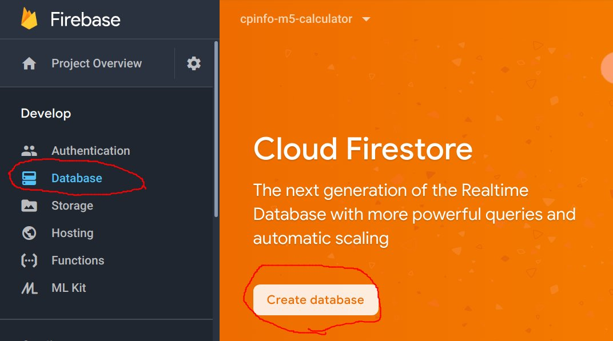
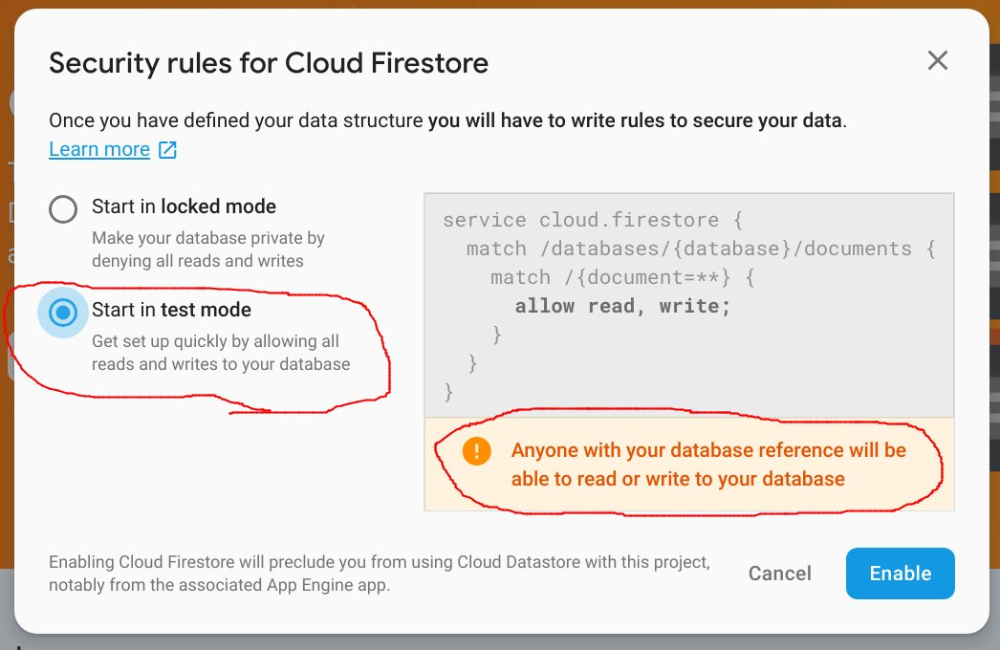
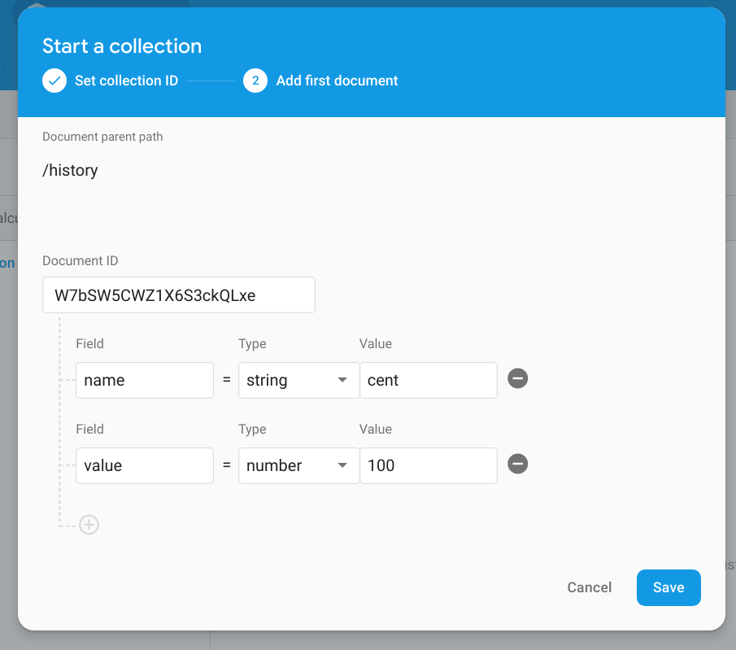
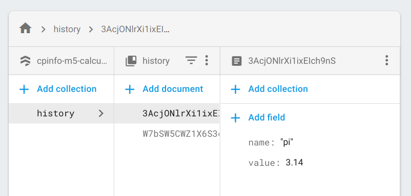
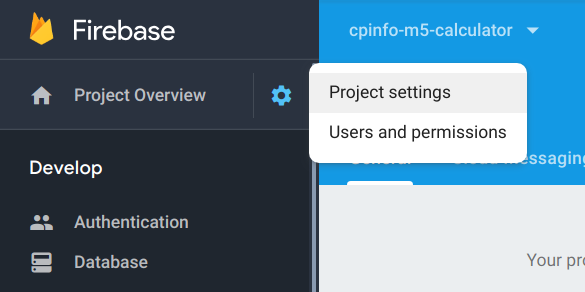
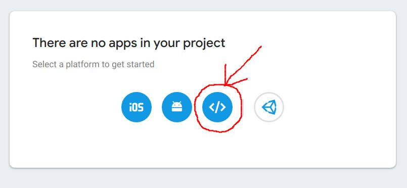
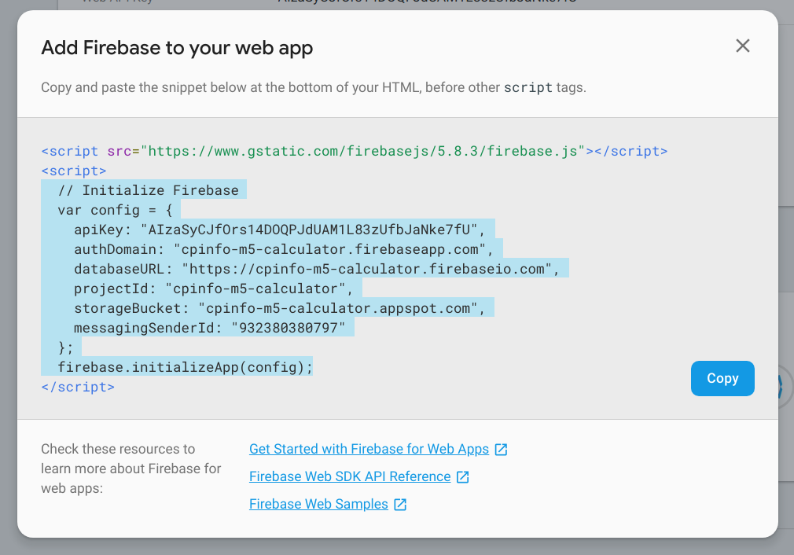

# Firebase Cloud Firestore

## 1 Enable Firestore NoSQL Database

1. In the firebase console, navigate to Database and click "Create Database"

   

1. Choose "Start in test mode". _⚠ Note the security warning: **your database is open for anyone to read/write!**_ Click "Create project".

   

## 2 Add history documents to DB

1. In the firebase console, navigate to the Database page

1. Click on "Add collection"

1. Give the collection the name `history` and click "Next".

1. Collections only exist if they contain documents. Therefore, we are required to create an initial document.
   * Click the button "Auto-ID" since we don't care about the name of the document.
   * The document should have 2 fields:
     * `name`: a string set to the display name value
     * `value`: a number set to the value we will load into the calculator.
   * Click "Save" to store the first document
  
   

1. Click "Add Document" in the `history` collection to add a second document. Use an auto ID, set the name to `pi` and the value to `3.14`

   Your collection should resemble this, with unique ids:

   

## 3 Fetch the history from Firestore

1. In the Firebase console, click on the setting gear then "Project settings"

   

1. Scroll down the settings page to the "Your apps" section. Click on the button to add a web app to the project

   

1. Copy the code to initialize the firebase connection.

   

1. Add the Firebase javascript client to our calculator project:

   ```cmd
   yarn add firebase
   ```

1. In `src/History.js` we have to initialize our connection to firebase. Before the declaration of the `History` component, import the firebase packages and paste the configuration code **from your project**. 

   ```jsx
   import React, {useEffect, useState} from 'react';
   import {Link} from 'react-router-dom';
   import firebase from 'firebase/app';
   import 'firebase/firestore';

   // COPY THIS FROM THE FIREBASE CONSOLE
   const config = {
     apiKey: "your-api-key",
     authDomain: "...",
     databaseURL: "...",
     projectId: "...",
     storageBucket: "...",
     messagingSenderId: "..."
   };
   firebase.initializeApp(config);

   const History = () => {
      // ...
   ```

1. Next we will replace the hardcoded links in the `History` with data that we will query directly from the database. In order for that to work, we will need to do the following:
   * Store the links in state using `useState` hook
   * Query the DB when the component is rendered the first rendered ("mounted") using the `useEffect` hook

   ```jsx
   const History = () => {
     const [history, setHistory] = useState([]);
     useEffect(() => {
       getHistory();
     }, []);

     async function getHistory() {
       const snapshot = await firebase.firestore().collection('history').get();
       // GET THE DATA FROM THE SNAPSHOT AND CALL setHistory()
       setHistory(/* PASS THE DATA FROM THE SNAPSHOT HERE! */);
     }

     return (
       <>
         <h1>history</h1>
         <ul>
           {history.map(h => <li key={h.name}><Link to={`/?value=${h.value}`}>{h.name}</Link></li>)}
         </ul>
       </>
     );
   }
   ```

   * `useEffect` _must not_ have a return value. Therefore we call the `getHistory()` function and never call return.
   * The `useEffect` hook will call the passed function based on when the values in the second parameter change. By passing an empty array `[]` the function is only called _once_ when the component is rendered the first time ("mounted").

#### Exercise 3.1 Complete the `getHistory()` function above to call `setHistory` with an array of links read from the database.

#### Bonus 3.1 Add some simple form controls to save history items back to the database. Can you add buttons to delete items?
