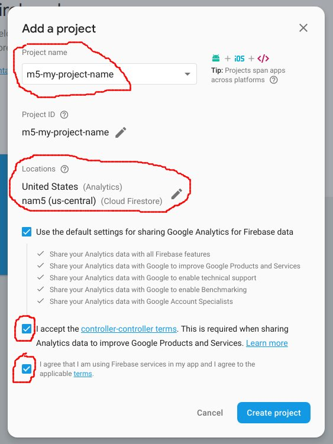

# Final Hackathon

[Steganography](https://en.wikipedia.org/wiki/Steganography) [Stéganographie](https://fr.wikipedia.org/wiki/St%C3%A9ganographie)

> the practice of concealing a file, message, image, or video within another file, message, image, or video - wikipedia

You will need these 2 packages:
* [lsb](https://github.com/hughsk/lsb)
* [jimp](https://github.com/oliver-moran/jimp/tree/master/packages/jimp)

From inside **functions** directory:
```cmd
cd functions
yarn add lsb jimp --ignore-engines
```

There are 5 images with data encoded in them.

The data has the following format:
```javascript
{
  index: 0,
  message: 'a secret message...',
}
```

Using these images:

* [a.png](images/a.png)
* [b.png](images/b.png)
* [c.png](images/c.png)
* [d.png](images/d.png)
* [e.png](images/e.png)

Use the following `decode()` function to decode the embedded data.

```javascript
const functions = require('firebase-functions');
const jimp = require('jimp');
const lsb = require('lsb');
const path = require('path')

async function decode(inputImage) {
  const image = await jimp.read(inputImage);
  const json = lsb.decode(image.bitmap.data, rgb);
  return JSON.parse(json);
}

function rgb(n) {
  return n + Math.floor(n / 3);
}

exports.index = functions.https.onRequest((request, response) => {

  const html = `
  <html>
    <body>
      <h1>this is html</h1>
      
    </body>
  </html>
  `
  response.send(html);
});

exports.imga = functions
  .https
  .onRequest(async (request, response) => {
    response.sendFile(path.resolve('./a.png'));
  });
```

Deploy a page that **dynamically**:

1. orders the images based on the value of `index` field encoded in the image
1. displays the secret message by concatenating the message segments in the order determined from their `index`
1. deploy your site to firebase
1. consider using 1 (or more) of the following:
   * a cloud function that renders a pug template or an html string
   * a react app (include the 5 images as static assets and load them with jimp by url)


## Create a new Firebase Project

1. [https://console.firebase.google.com](https://console.firebase.google.com)
1. Sign in to your google account
1. "Add project"
1. Give your project a unique name, keep the default settings, and accept all of the options:
   


## Function with hosting

```
mkdir hackathon
cd hackathon
yarn init
yarn add --dev firebase-tools
```

inside `package.json` add:
   `package.json`:
   ```javascript
   // ...

   "scripts": {
     // ...
     "firebase": "firebase"
   },

   // ...
   ```

1. Enable Firebase functions:
   ```cmd
   npm run firebase -- init
   ```
   
   1. Choose "Functions"
   1. Select "JavaScript"
   1. "Do you want to use ESLint to catch probable bugs and enforce style?" **enter `n`**
   1. "Do you want to install dependencies with npm now?" **enter `n`**

1. Associate your firebase project:
   ```cmd
   npm run firebase -- use --add
   ```
   Select your project and name it `default`.


1. Modify your functions to use the [node.js version 8 runtime](https://firebase.google.com/docs/functions/manage-functions#set_nodejs_version).

   In `functions/package.json` add:
   ```
   "engines": {
     "node": "8"
   },
   ```

1. Install the dependencies with yarn (or npm):
   ```cmd
   cd functions
   yarn --ignore-engines
   ```

   ⚠️ _Note: `yarn` or `yarn install` will enforce the engine that we added to `package.json`. Therefore, we should use the `--ignore-engines` flag with yarn or use `npm install`. You can make this permanent for your `functions` directory by running `echo "--ignore-engines true" > .yarnrc`_

1. In vscode, open `functions/index.js` and **un-comment** all of the lines of code.

**FROM THE ROOT OF YOUR PROJECT:**
```cmd
npm run firebase -- deploy
```
